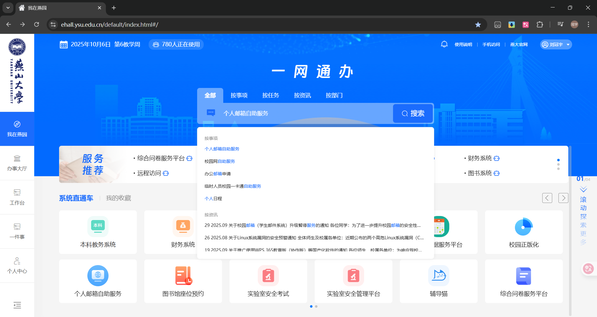
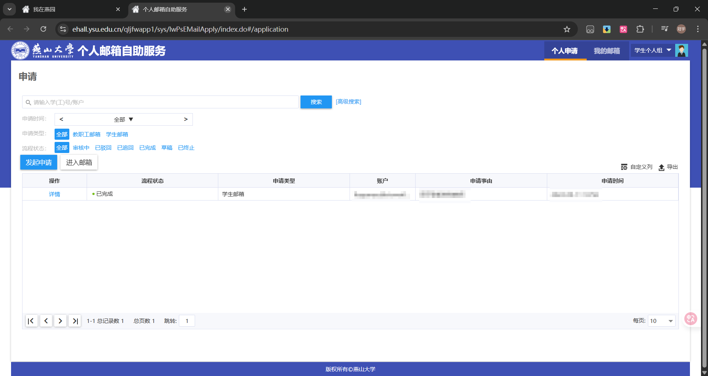
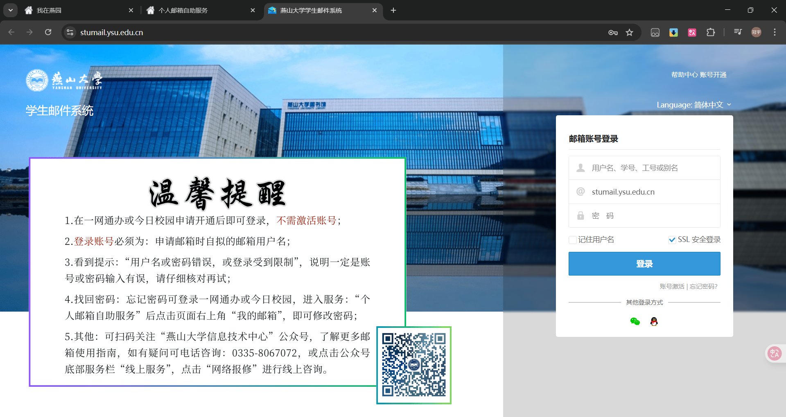
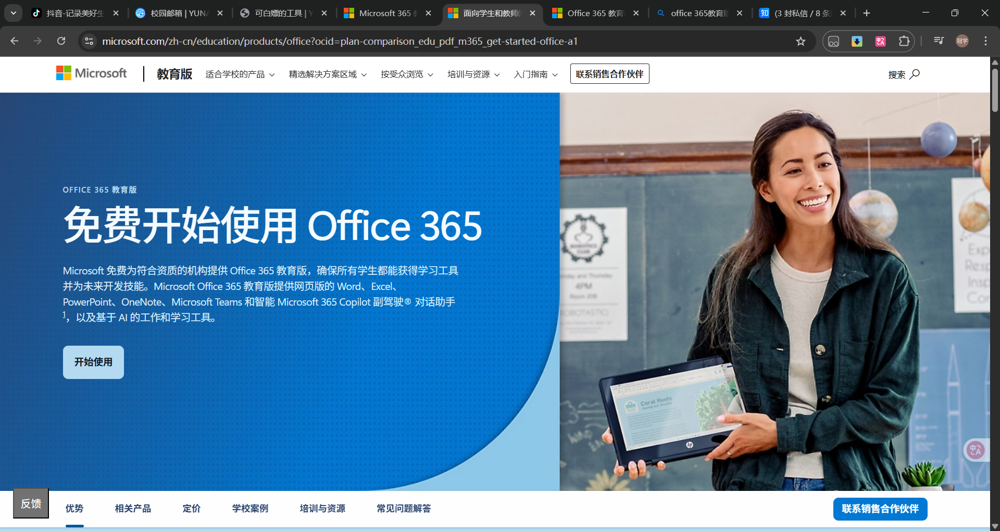
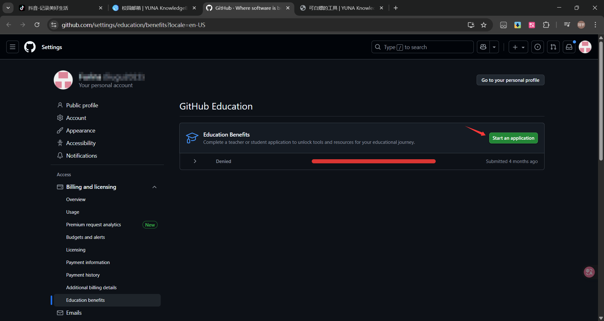
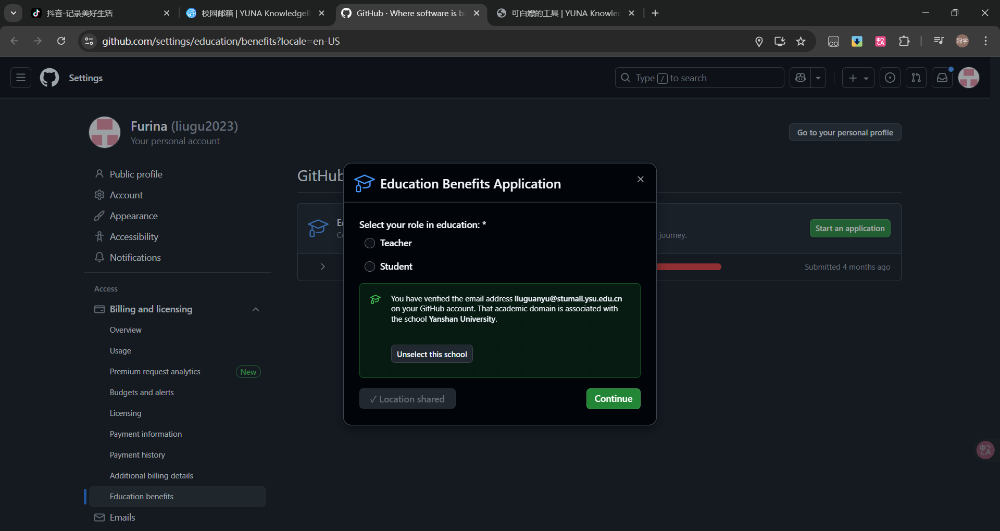
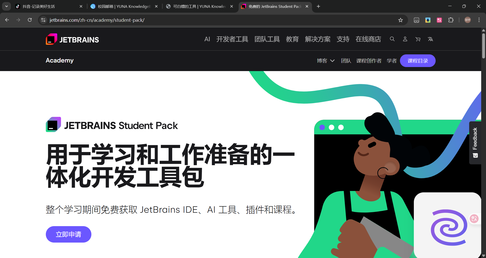

---
tags:
  - 校园邮箱
  - 学生权益
  - 校园服务
authors:
  - liugu2023
---

# 校园邮箱

## 简介

校园邮箱是学校面向符合条件的师生提供的邮箱服务，可用于校内通知、期刊投稿和学生身份验证。有些教育计划接受校园邮箱作为证明材料，但是否通过还取决于服务商的资格规则和审核结果。校园邮箱本身不保证获得 Microsoft 365、GitHub Education 或 JetBrains 等第三方权益。

## 账号申请与管理

### 申请

1. 进入[一网通办](https://ehall.ysu.edu.cn/default/index.html#/)，搜索`个人邮箱自助服务`，点击进入。
   
2. 点击`发起申请`。
   
3. 按页面要求填写申请理由和邮箱名称，确认信息无误后提交。
4. 在一网通办中查看办理状态。邮箱命名规则、审批方式和完成时间以当前系统提示为准。

### 登录

申请完成后，进入[邮箱登录页面](https://stumail.ysu.edu.cn/)，按页面提示登录。

## 可申请的教育权益

下面列出几个常用的教育计划入口。这些计划由第三方运营，资格、功能和续期规则可能变化；申请前应阅读对应服务商的最新说明。

### [Microsoft 365 教育版](https://www.microsoft.com/zh-cn/education/products/office?ocid=plan-comparison_edu_pdf_m365_get-started-office-a1)

可在 Microsoft 教育版页面输入校园邮箱，按当前页面尝试验证资格。

能否注册、获得哪一种计划以及可以使用哪些应用，取决于学校租户配置、管理员分配和 Microsoft 当时的政策，并非拥有校园邮箱就会自动开通。需要安装桌面版 Office 时，也可以查看学校的[校园正版化平台](./campus-ms-index.md#常用软件)。

### [GitHub](https://github.com/)

GitHub 是常用的代码托管平台。校园邮箱不是使用 GitHub 的必要条件，但经过验证的学校邮箱和在读证明可用于申请 GitHub Education。

申请前可阅读[GitHub Education 学生申请说明](https://docs.github.com/en/education/about-github-education/github-education-for-students/apply-to-github-education-as-a-student)和[个人账户产品说明](https://docs.github.com/en/get-started/learning-about-github/githubs-products#github-free-for-user-accounts)。大致流程如下：

1. 在 GitHub 账户中添加并验证校园邮箱。
2. 打开[教育权益页面](https://github.com/settings/education/benefits?locale=en-US)，按当前页面发起申请。
   
3. 选择学校，并根据页面要求提供在读证明。可接受的材料、定位要求和按钮名称会变化，不要把旧截图当作固定流程。
   
4. 提交后回到教育权益页面查看状态。审核时间和结果以 GitHub 通知为准。

上传材料前遮盖与审核无关的敏感信息，并确保姓名、学校和当前在读时间等必要内容清晰可见。如果页面要求与本文截图不同，以 GitHub 官方说明为准。

### [JetBrains 全家桶](https://www.jetbrains.com/)

JetBrains 学生授权可用于 IDEA、PyCharm、WebStorm 等专业版 IDE。

打开[JetBrains 学生授权页面](https://www.jetbrains.com/community/education/#students)，选择当前可用的验证方式并按要求提交材料。

校园邮箱通常可作为验证方式之一，但并不保证自动通过。可用方式、表单字段、授权期限和续期要求均以 JetBrains 当前页面及邮件通知为准。
