# 校园正版化

燕山大学正版软件管理与服务平台提供 Windows、Office、Visio、WPS、福昕 PDF 编辑器、中望 CAD、MWORKS 等软件。实际可下载的软件和版本以平台当前页面为准。此外，学校面向师生提供 [WPS 365 教育版（企业会员）](#wps-365-教育版企业会员) 授权，见下文专门介绍。

## 访问方式

可通过一网通办搜索`校园正版化`并点击进入，或访问[燕山大学正版软件管理与服务平台](https://software.ysu.edu.cn/)。
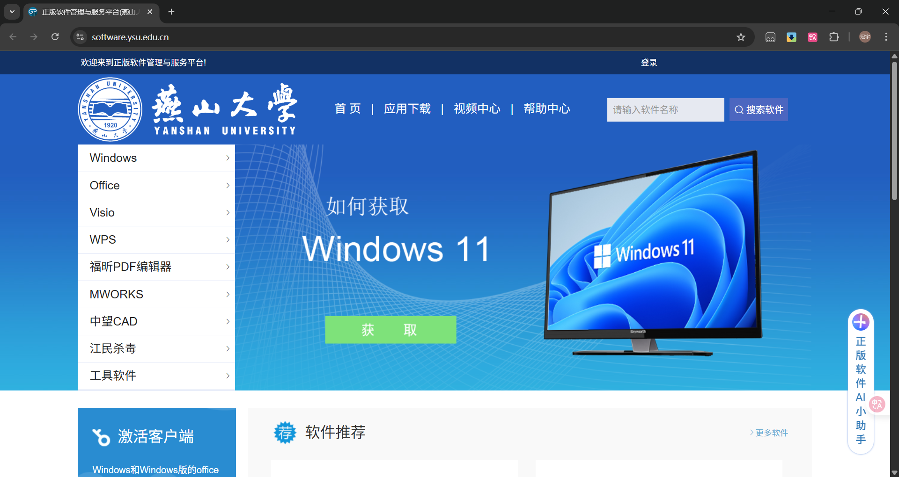

## WPS 365 教育版（企业会员）

学校面向全校师生提供 WPS 365 教育版（协作版）企业会员授权：无需个人开通付费会员，即可使用文字、表格、演示、PDF 等应用及配套的云文档、AI、协作权益。官方依据为信息技术中心 2025-09-19 发布的[《关于推广使用WPS 365教育版（协作版）等国产化软件的通知》](http://notice.ysu.edu.cn/info/2073/23311.htm)。

### 会员权益

- **办公套件与格式兼容**：文字、表格、演示、PDF，另有智能文档、多维表格；可直接打开和编辑 `.docx`、`.xlsx`、`.pptx` 等常见 Office 格式，PDF 可直接阅读与编辑。
- **云文档与多端同步**：文档实时保存、云端存储，PC 与移动端跨设备同步；支持云端协作共享与云端资源库。
- **在线协作**：多人同时编辑同一文档，支持评论与版本管理，适合小组作业和文档交接。
- **模板与素材**：海量模板（工作计划、调研报告、简历等），并含学校专享模板库。
- **PDF 工具**：PDF 转 Word/Excel/PPT（支持批量）、PDF 编辑、合并与拆分、扫描件文字识别。
- **AI 助手（灵犀）**：写作（AI 伴写、总结、润色、论文/公文一键排版）、阅读（全文总结、文档问答、文档脑图）、设计（AI 生成 PPT、单页美化）、数据（图表解读、AI 写公式、条件格式），以及 AI 会议纪要。
- **会议与听记**：WPS 会议在线视频会议、WPS 听记录音转文字。
- **数据安全**：数据恢复（备份中心）和文档修复，可找回误删或损坏的文档。
- **其他**：表单（信息收集、报名接龙、作业提交、问卷）、在线思维导图与流程图、全文翻译、图片处理、即时通讯、轻打卡、待办中心等。

> **提示**
>
> - 部分权益带数量限额，如 WPS 听记 360 分钟/人/31 天、全文翻译 500 页/月、WPS 会议 640 分钟/人/月（单场最长 24 小时、单场 100 人，可扩展）。以上为官方通知（2025-09-19）发布时口径，实际以登录后的页面为准。
> - 权益内容可能随学校采购与厂商政策调整，本页核对时间：2026-08-31。

### 登录方式

1. 进入 WPS 打开登录页面，点击 `专属账号` 登录，如图所示：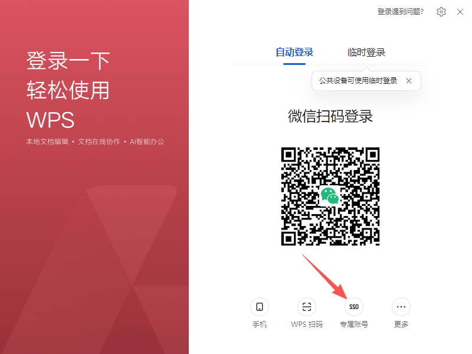
2. 输入燕山大学企业代码 `ysu` 后点击验证，如图所示：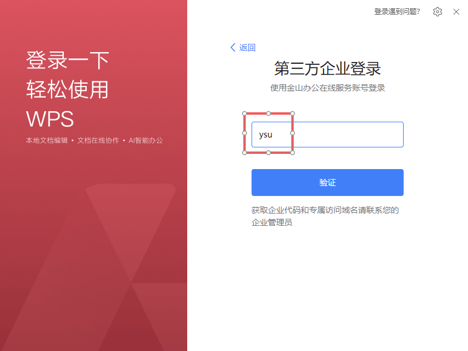
3. 使用一网通办账号密码验证，如图所示：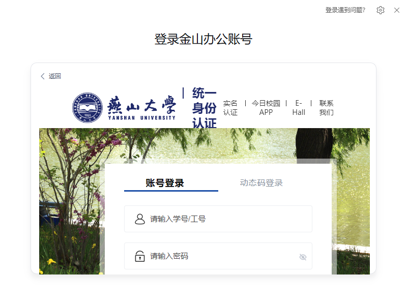
4. 随后完成登录流程，如图所示：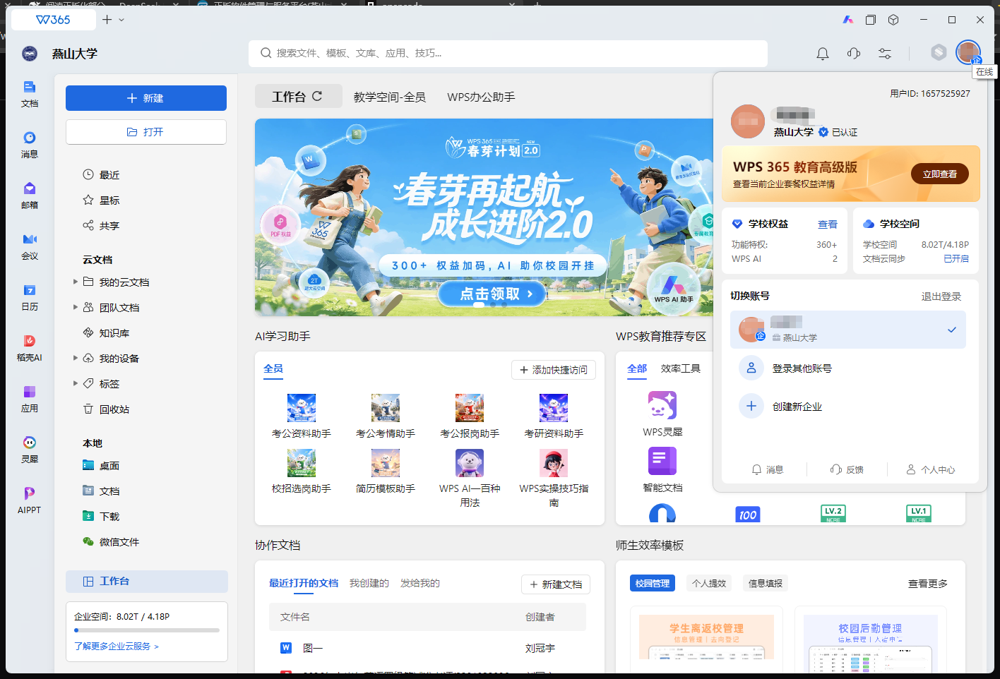

## 常用软件

下面介绍几个常用软件的下载入口。截图中的版本和按钮可能随平台更新。

### Windows

新装电脑应优先选择满足硬件要求、仍在 Microsoft 支持期内的 Windows 11 版本。在主页点击`Windows`板块，再选择平台当前提供的受支持版本。
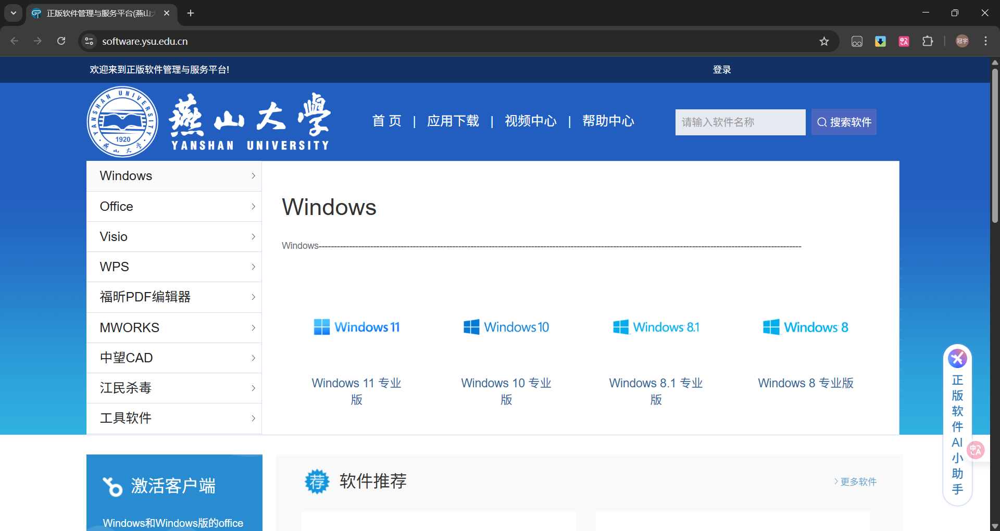
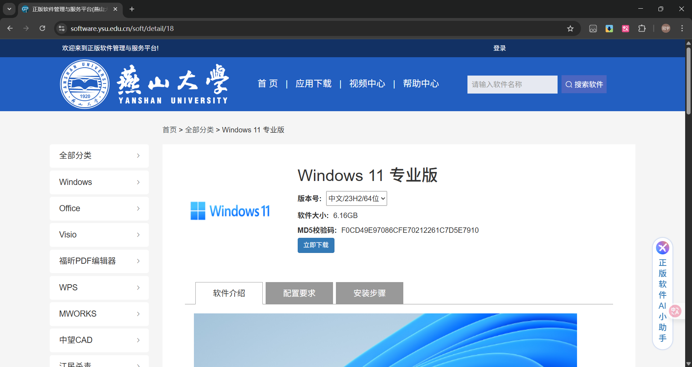
进入详情页后，可下载 ISO 镜像并查看安装指引。

> **提示**
>
> 平台当前的激活帮助入口为[帮助页面](https://software.ysu.edu.cn/help/detail/2)。请登录后确认说明适用于自己安装的系统版本。

### Office

在主页点击`Office`板块，优先选择平台当前提供且仍在支持期内的版本。下面的截图以 Office 2021 为例。
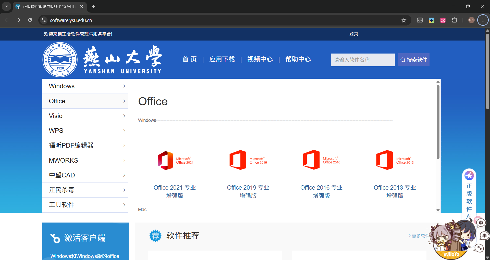
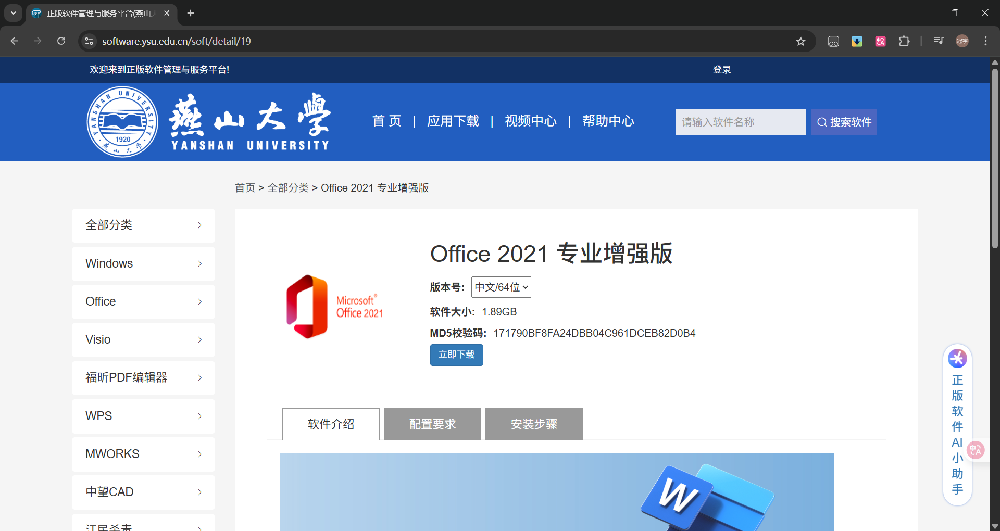
进入详情页后，可下载安装文件并查看安装指引。

> **提示**
>
> 平台当前的激活帮助入口同样指向[帮助页面](https://software.ysu.edu.cn/help/detail/2)。请登录后按所装产品的实际说明操作。

### Visio

在主页点击`Visio`板块，选择平台当前提供且仍在厂商支持期内的版本。下面的截图以 Visio 2021 为例。
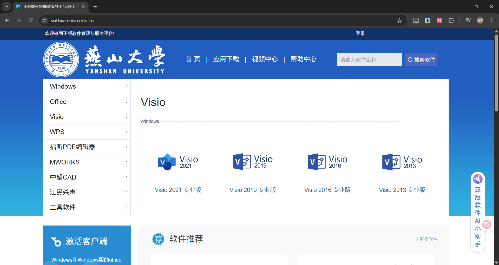
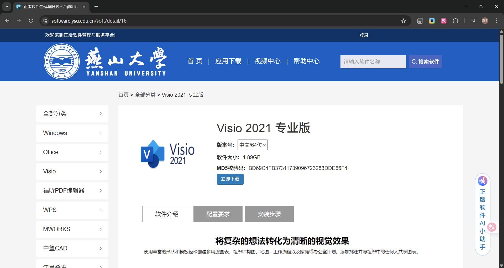
进入详情页后，可下载安装文件并查看安装指引。

### 福昕PDF编辑器

在主页点击`福昕PDF编辑器`板块，再选择与自己操作系统匹配的版本。
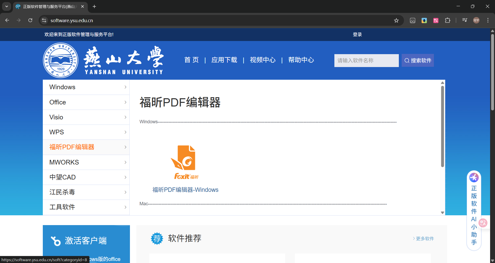
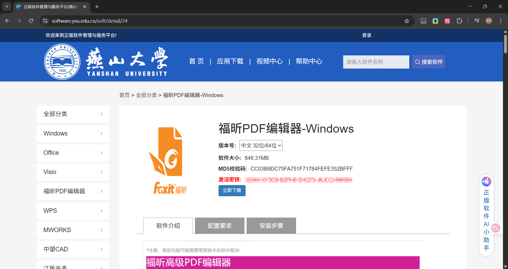
进入详情页后，可下载安装文件并查看安装指引。

### WPS

WPS Office（文字、表格、演示、PDF）属于学校正版授权软件，且学校为师生开通了 WPS 365 教育版会员权益，详见[WPS 365 教育版（企业会员）](#wps-365-教育版企业会员)一节。

### 更多软件

更多软件请访问平台首页查看。
