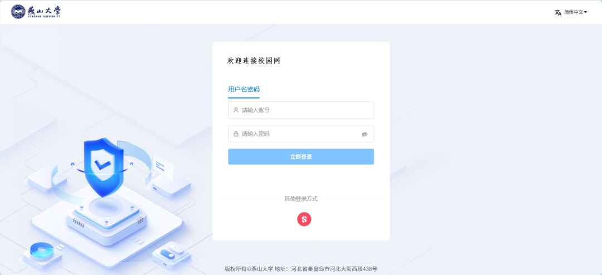
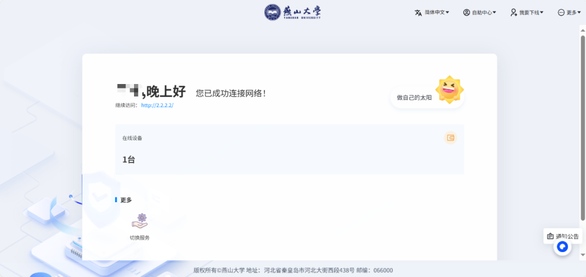
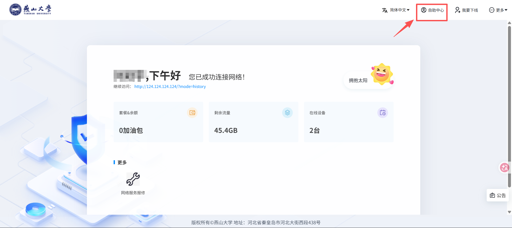
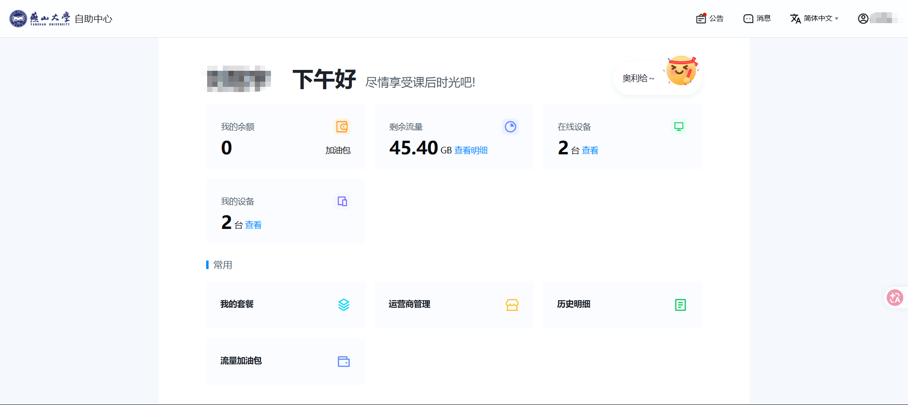
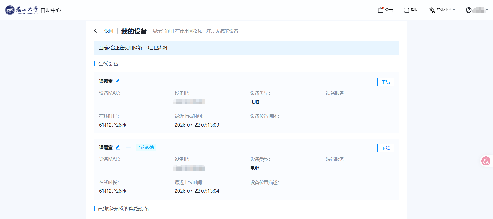
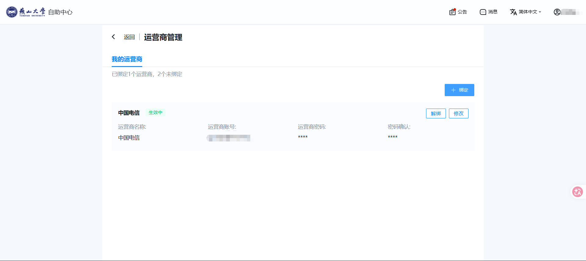

---
tags:
  - 校园网
  - 网络认证
authors:
  - liugu2023
---

# 校园网连接与认证

## 首次连接

### 进入认证页面

连接校园网后，手机或电脑通常会自动打开认证页面。如果没有弹出，可在浏览器中访问 [auth1.ysu.edu.cn](http://auth1.ysu.edu.cn)

### 登录校园网

通过统一身份认证登录后，可从当前可用的服务中选择一项登录。服务名称、首次登录选项和按钮文字可能调整，以当前页面提示为准。

## 非首次连接

再次连接时，仍按认证页提示登录。服务列表会随账号状态、已办理业务和系统设置变化；页面没有显示的服务，不要根据旧截图自行填写。

## 进入自助服务

认证页或认证成功页通常提供`自助服务`入口，具体位置以当前页面为准。

### 自助服务页面介绍

自助服务中的栏目会随系统更新而变化，可能包括在线设备、套餐或业务明细、网络信息和运营商绑定等。本人套餐、流量、可同时在线设备数和服务有效期，应以登录后显示的信息为准。

### 当前在线设备信息查看及管理

如果当前页面提供`我的设备`或类似入口，可在其中查看和管理在线设备。可见字段及可执行操作以系统实际显示为准。

### 我的运营商

如果已经通过运营商官方渠道办理了校园宽带，并且自助服务当前提供运营商绑定入口，可按页面要求绑定。账号格式、密码、可用服务和生效时间以运营商合同、官方客服及当前系统提示为准。

遇到账号或套餐问题，请联系对应运营商的官方客服或营业厅，不要把密码、短信验证码交给个人推销者。

其他故障可参考[校园网常见问题](./campus-network-qa.md)。
