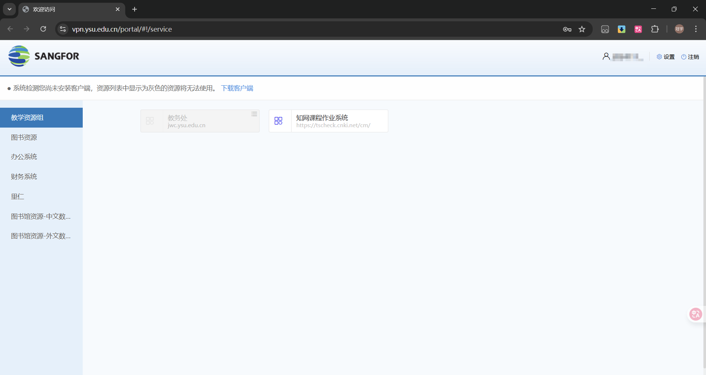

---
tags:
  - WebVPN
  - 校园网
  - 网络服务
authors:
  - liugu2023
---

# 学校 WebVPN（校外访问系统）

学校 WebVPN 用于在校外访问部分校内系统和学校已购买的电子资源。它不是通用互联网代理，也不会让所有网站都获得“校园网环境”。可访问的服务以入口页当前发布的列表为准。

打开[学校 WebVPN](https://vpn.ysu.edu.cn/portal/#!/service)，按页面提示登录，再从服务列表进入所需系统。

