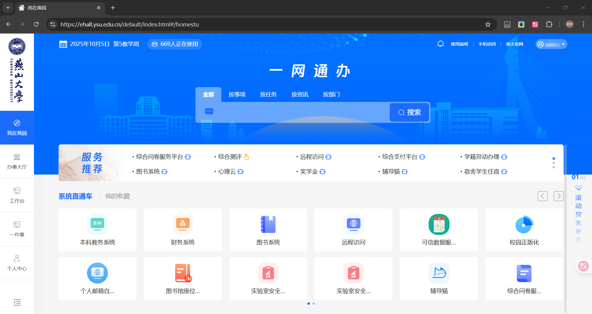
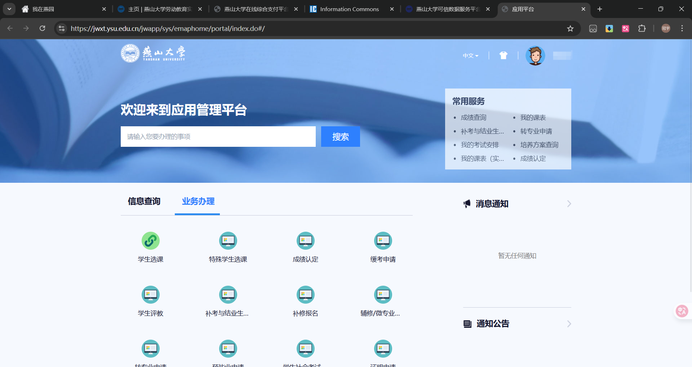
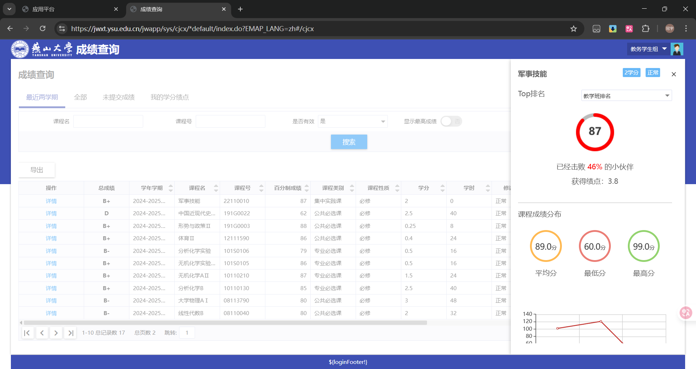
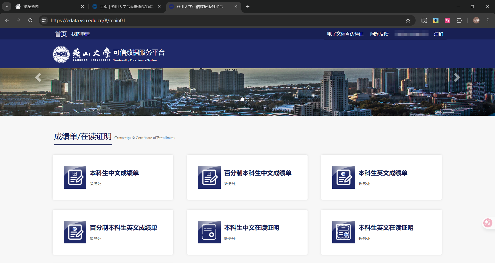

---
tags:
  - 一网通办
  - 校园服务
authors:
  - liugu2023
---

# 一网通办

这里介绍网页版一网通办平台。`今日校园` App 中也可能提供部分服务，具体功能以当前页面为准。

## 简介

一网通办集成了成绩查询、费用缴纳和图书馆座位预约等常用服务。服务列表、办理流程和规则会调整，本文截图只用于帮助识别入口。

## 访问方式及使用指南

入口：[燕山大学一网通办](https://ehall.ysu.edu.cn)。登录后，可在主页搜索框中查找服务事项。

## 常用功能介绍

下面列出几个常用入口。

### 本科教务系统

[访问链接](https://jwxt.ysu.edu.cn/)
本科教务系统提供成绩、课表、培养方案、选课和评教等教务功能。每名学生能看到的事项取决于当前开放安排。

如果页面提供搜索框，可直接搜索所需事项。

#### 成绩查询

在成绩查询或`我的学分绩点`页面，可以查看系统当前提供的成绩和统计字段。**注意：未完成评教将无法查看成绩！**

转专业、奖学金、推免等事项可能采用不同的课程范围和计算办法，不能直接把教务系统中的某一个平均绩点当作所有评定的统一依据。申请前应查阅对应年度的正式通知。绩点与成绩的一般对应关系可参考教务处发布的[说明](https://jwc.ysu.edu.cn/info/1089/3412.htm)。

页面提供导出功能时，可以下载成绩表。导出的文件包含个人信息，应妥善保存。

#### 课表查询

进入课表查询后，可按当前页面切换学期课表或周课表。上课时间和地点如有临时调整，以任课教师及学院通知为准。

#### 培养方案查询

培养方案用于查看本专业的课程与学分要求。

### 图书馆座位预约

[访问链接](http://seat.ysu.edu.cn/)  
考研复习阶段和期末考试前，图书馆座位会比较紧张。需要提前占座时，可以使用座位预约系统。

系统可用于查看和预约当前开放的座位或研讨间。

预约前请阅读系统当日显示的规则和图书馆最新通知，尤其留意签到、暂离、取消及违约提示。系统显示与本文截图不同时，以当前系统为准。

### 可信数据服务平台

[访问链接](https://edata.ysu.edu.cn/)  
可信数据服务平台用于申请系统当前提供的成绩或证明材料。

可申请的文件种类、是否带电子印章及交付方式以当前页面说明为准。提交前核对接收信息，收到的文件包含个人成绩等敏感信息，不要转发到不可信平台。

### 劳动教育课程管理平台

[访问链接](https://ldxt.ysu.edu.cn/)  
劳动教育课程管理平台可用于查看本人记录和当前开放的活动。

劳动教育要求可能因入学年级、专业培养方案和学院安排而不同。毕业所需课程、学时或其他条件，应以本人培养方案及学院、教务部门的最新通知为准，不能只参考往届数字。
