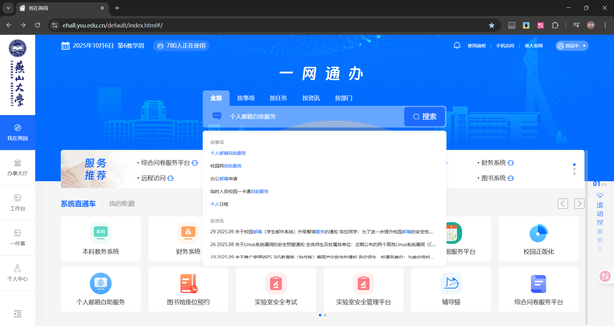
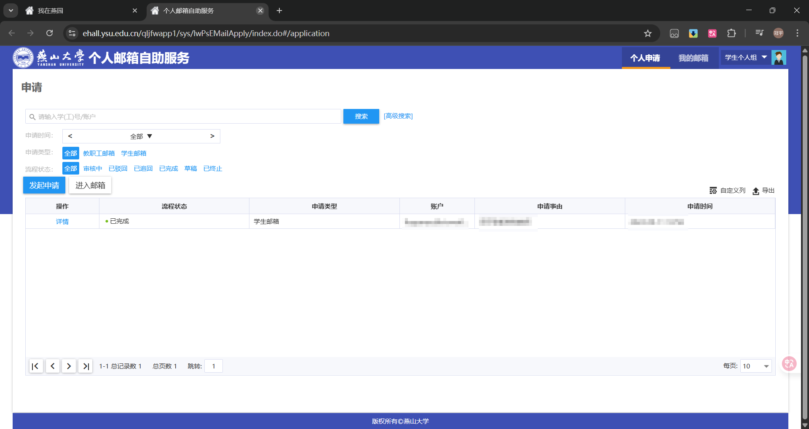
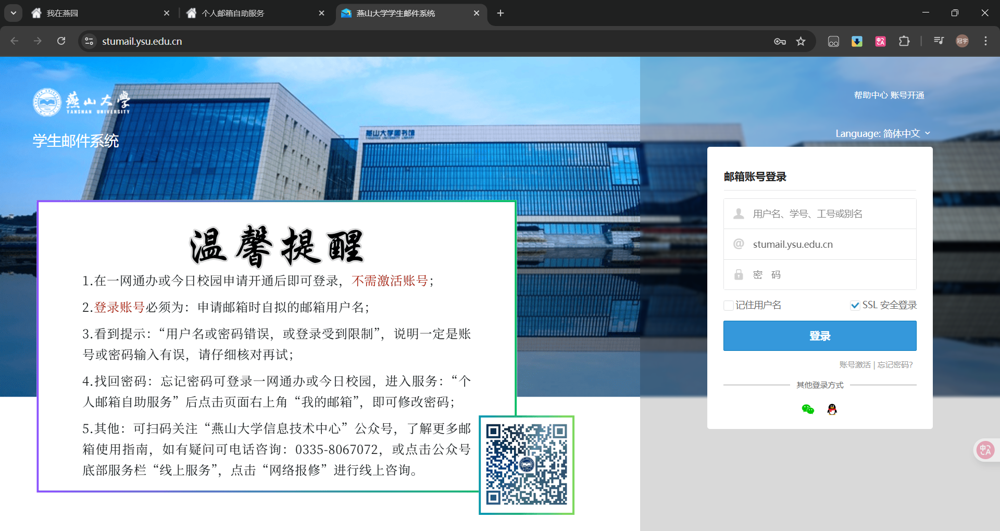
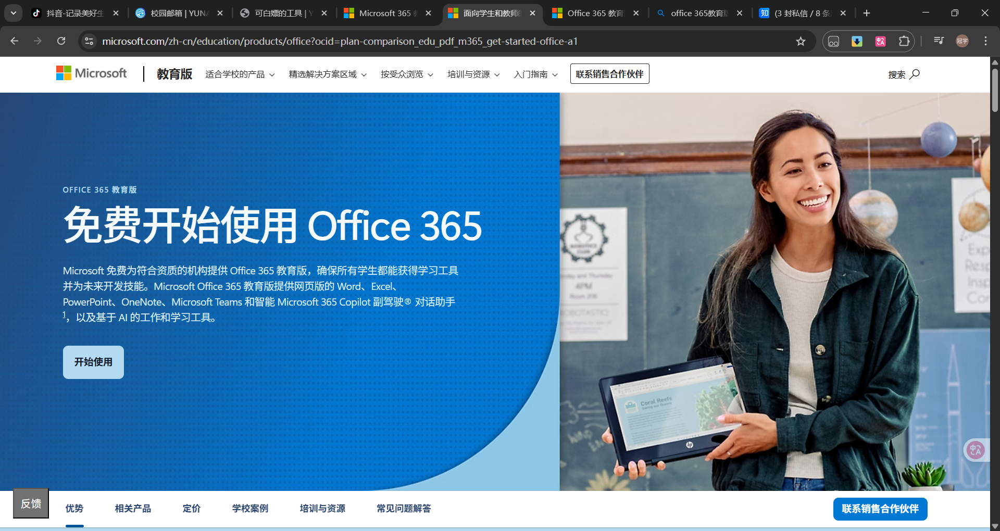
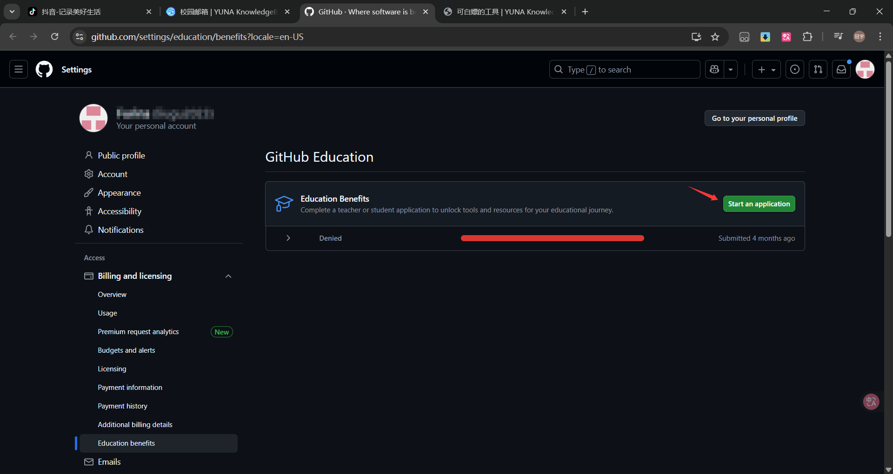
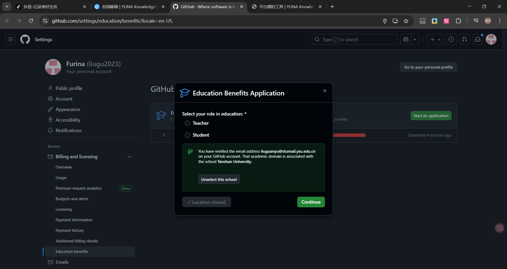
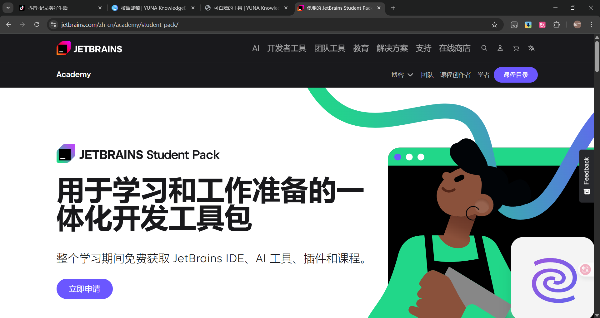

# 校园邮箱

## 简介

校园邮箱是由学校信息技术中心提供的邮箱服务，仅在校学生和教职工有权使用。 所以在期刊投稿等一些正式场合，一般需要我们采用校园邮箱收发信件以代表身份。  
除此之外的用途也自然有很多，~~其中最重要的就是白嫖许多好东西~~： 比如说 OneDrive ；对于计算机相关专业的同学来说还有更多实用的工具，如 Jetbrains 全家桶等。 Apple 等企业的教育优惠也一般需要我们使用校园邮箱申请。

## 账号申请与管理

### 申请

1. 进入[一网通办](https://ehall.ysu.edu.cn/default/index.html#/)，搜索`个人邮箱自助服务`，点击进入。

2. 点击`发起申请`

3. 申请理由随便填，邮箱名称随便填（不合法的邮箱名称会随机分配）
4. 然后等待几天即可。

### 登录

申请完成后，进入[邮箱登录页面](https://stumail.ysu.edu.cn/)，输入账号密码即可登录。

## 可以白嫖的工具

我们申请的校园邮箱可以用来白嫖一系列工具~~俗称学费回收计划~~

### [Office 365](https://www.microsoft.com/zh-cn/education/products/office?ocid=plan-comparison_edu_pdf_m365_get-started-office-a1)

申请流程：点击链接跳转后点击开始使用

填写你申请到的校园邮箱账号并根据提示注册即可。
（A1计划只能在网页端使用，若要使用桌面版的Office，请参照[校园正版化](../ms/index.md#常用软件)）中的Office板块。

### [github](https://github.com/)

> 作为全球最大的git托管平台，而且基本上与编程相关的网站都可以关联Github帐号，可以说是非常非常的重要的了，至于为什么不放到第一位，只是因为他对计算机专业的而言，对其他专业嘛不好说

虽然Github 不使用校园邮箱也是可以用的，但是有了校园邮箱就能使用Pro版($4/month)，能白嫖，何乐而不为？[Free 与 Pro比较](https://docs.github.com/en/get-started/learning-about-github/githubs-products#github-free-for-user-accounts)  
申请流程：

<!-- markdownlint-disable MD029 -->

1. 点击[链接](https://github.com/settings/education/benefits?locale=en-US)，登录你的github账号后会进入申请页面。

>注意，这里的github账号需要绑定你的校园邮箱账号。

2. 点击`Start an application`，弹出一个申请窗口。

3. 如果你的校园邮箱绑定正确的话，这里会自动弹出`Yanshan University`，点击`Select this school`即可。

4. 点击`Share Location`，授予github访问你的位置信息的权限，这时你要保证你的电脑位于燕山大学校内，等待按钮变成`Location Shared`，然后点击`Continue`。

5. 在下一个窗口内选择一个佐证材料，推荐选择第一个`Dated school ID`，然后点击`Start Camera`，将你的学生证拍照上传，后点击`Continue`

6. 等待一段时间后重新进入第一步的链接，即可查看申请状态。

<!-- markdownlint-enable MD029 -->
::: tip tip
申请过程中全程不可以使用VPN，鉴于国内网络环境的问题，申请流程可能会失败 ~~作者本人的申请就一直没过~~
:::

### [Jetbrains 全家桶](https://www.jetbrains.com/)

jetbrains家的工具可以说是非常的好用，而且**特别的人性化，用高端一点的说法是叫符合人体工程学。**
>Jetbrains的学生认证需要每年都更新一次
申请流程：

1. 点击[链接](https://www.jetbrains.com/zh-cn/academy/student-pack/)进入学生版主页。

2. 点击`立即申请`，在新的页面中，`申请方式`默认为校园邮箱申请，不用动，`状态`点击`我是学生`，`国家/地区`选择`中国大陆`，`教育程度`选择`大学生`，`计算机科学或工程学是您的主要研究领域吗？`随便选，`电子邮件地址`填写你的校园邮箱地址，`个人电子邮件地址`填写一个除校园邮箱外的你本人的邮件地址，然后点击验证按钮，最后填写上你的姓名，并点击`申请免费产品`即可。
