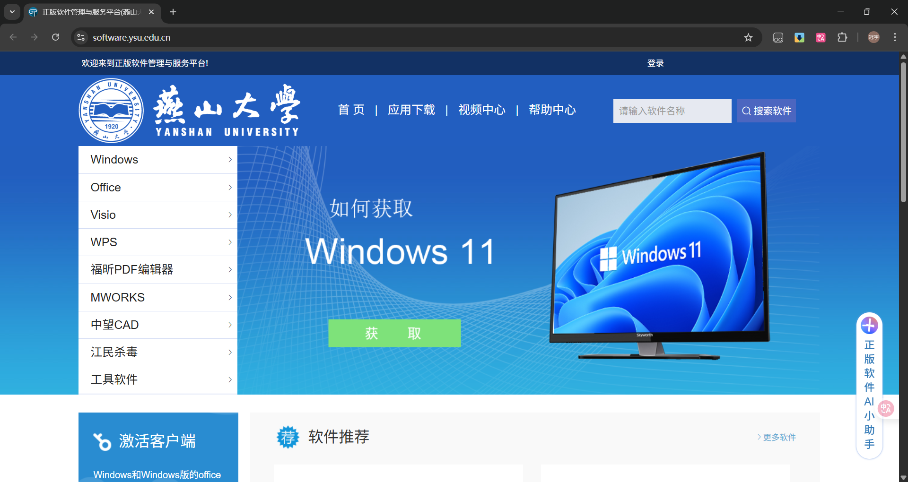
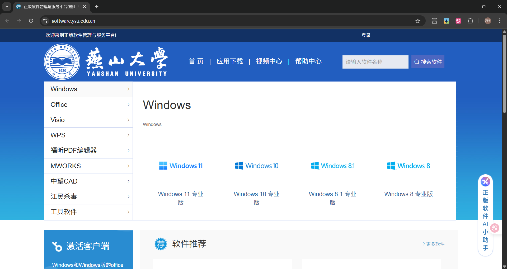
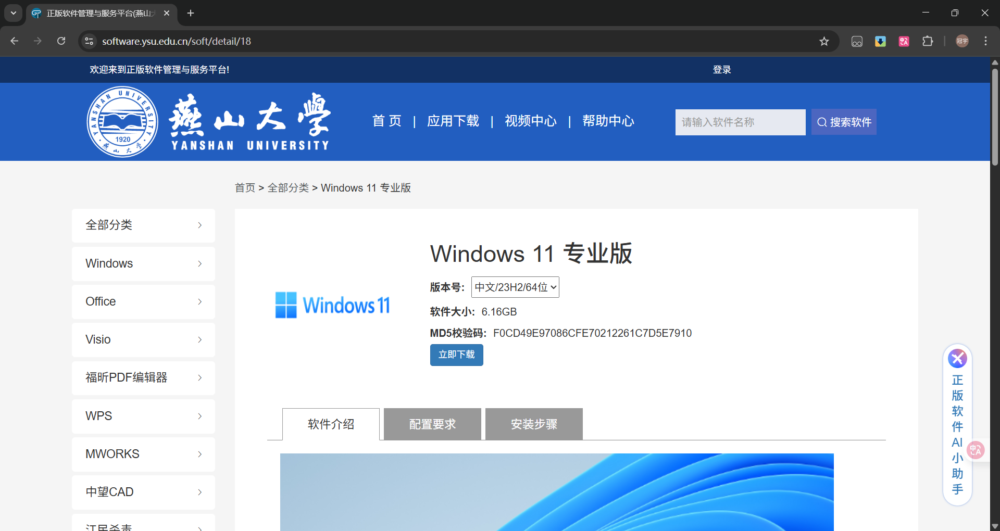
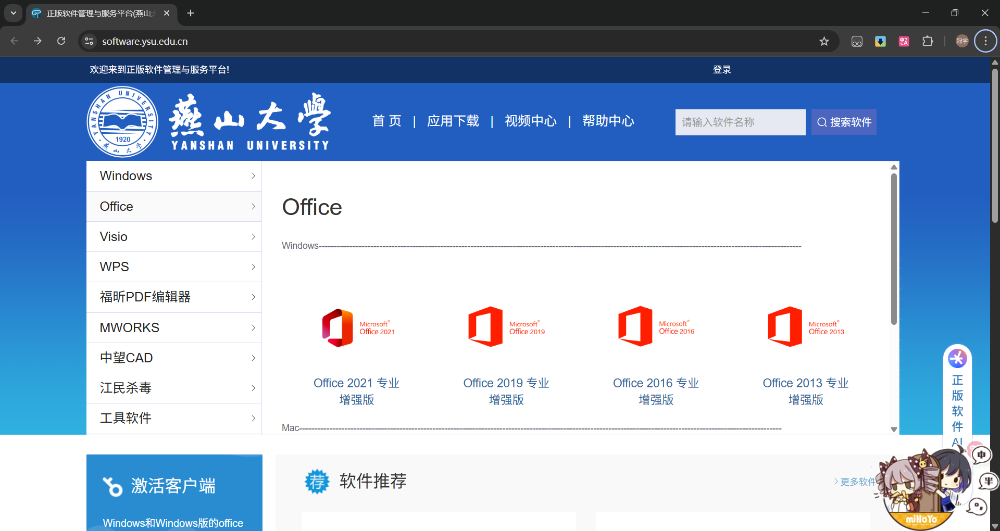
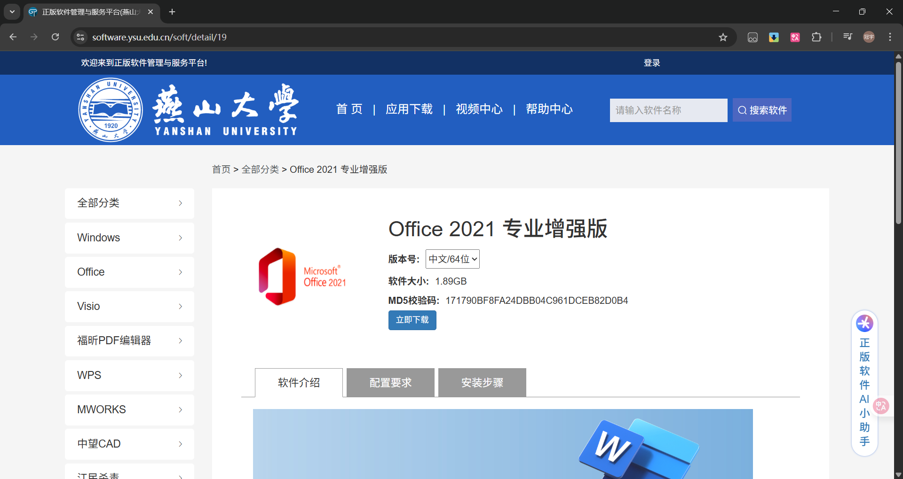
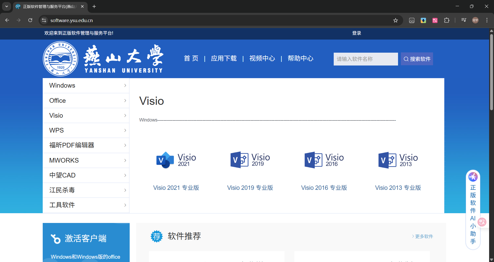
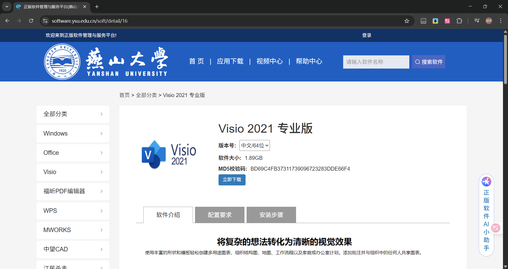
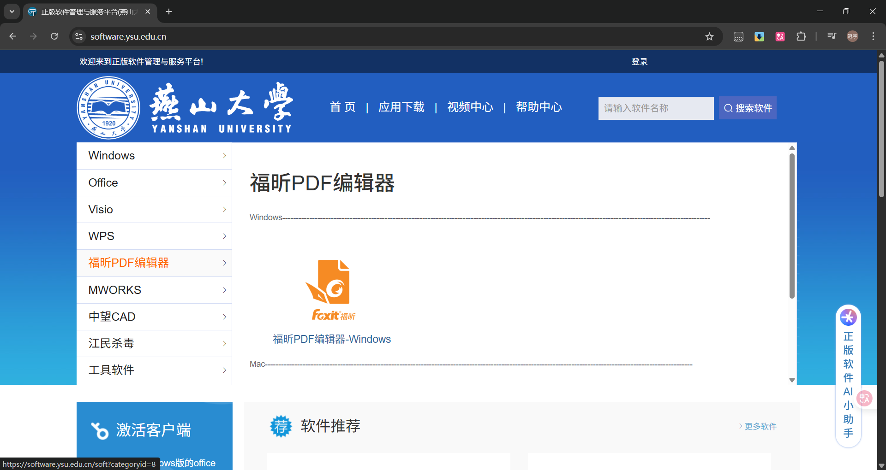
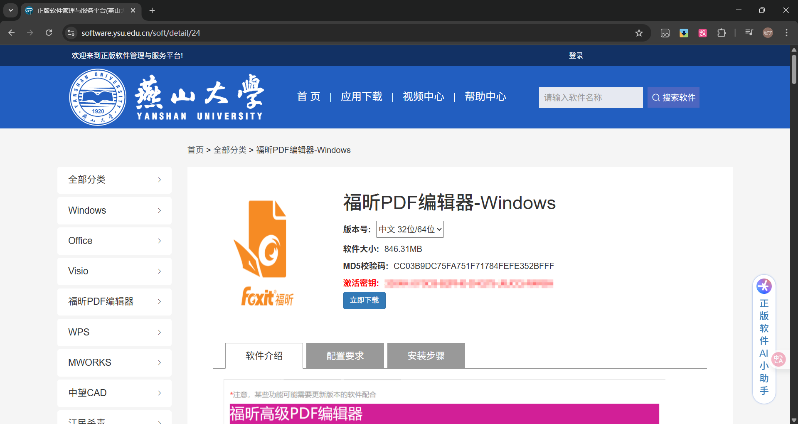

# 校园正版化

燕山大学正版软件管理与服务平台，为全校师生提供了常用的正版软件，如Windows、Office、Visio、WPS、福昕PDF编辑器、中望CAD、MWORKS等。

## 访问方式

可通过一网通办搜索`校园正版化`并点击进入，或使用网址[https://software.ysu.edu.cn/](https://software.ysu.edu.cn/)进入。

## 常用软件

下面介绍几个常用软件的安装

### Windows

平台提供Windows `11/10/8.1/8`的专业版，下面以Windows11为例，介绍安装流程。  
首先，在主页里点击`Windows`板块，在展开的按钮中选择`Windows11 专业版`

点击后会进入一个新页面

在这个页面即可下载ISO镜像文件并查看安装指引。
::: tip tip
系统激活请查阅[系统激活](https://software.ysu.edu.cn/help/detail/2)
:::

### Office

平台提供Windows平台下的Office `2021/2019/2016/2013` 专业增强版，以及Mac平台下的Office `2021/2019/2016/2011` 标准版，下面以Windows平台下的Office2021为例，介绍安装流程。  
首先，在主页里点击`Office`板块，在展开的按钮中选择`Office2021 专业增强版`

点击后会进入一个新页面

在这个页面即可下载ISO镜像文件并查看安装指引。
::: tip tip
软件激活请查阅[软件激活](https://software.ysu.edu.cn/help/detail/2)
:::

### Visio

平台提供Visio `2021/2019/2016/2013` 专业版，下面以Visio2021为例，介绍安装流程。  
首先，在主页里点击`Visio`板块，在展开的按钮中选择`Visio2021 专业版`

点击后会进入一个新页面

在这个页面即可下载ISO镜像文件并查看安装指引。

### 福昕PDF编辑器

平台提供福昕PDF编辑器的Windows和Mac版，下面以福昕PDF编辑器的Windows版为例，介绍安装流程。  
首先，在主页里点击`福昕PDF编辑器`板块，在展开的按钮中选择`福昕PDF编辑器-Windows`

点击后会进入一个新页面

在这个页面即可下载安装文件并查看安装指引。

### 更多软件

更多软件请访问平台首页查看。
