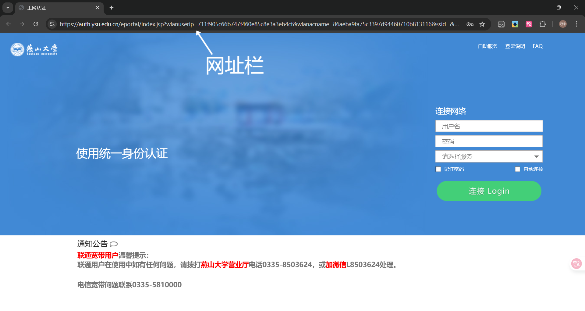
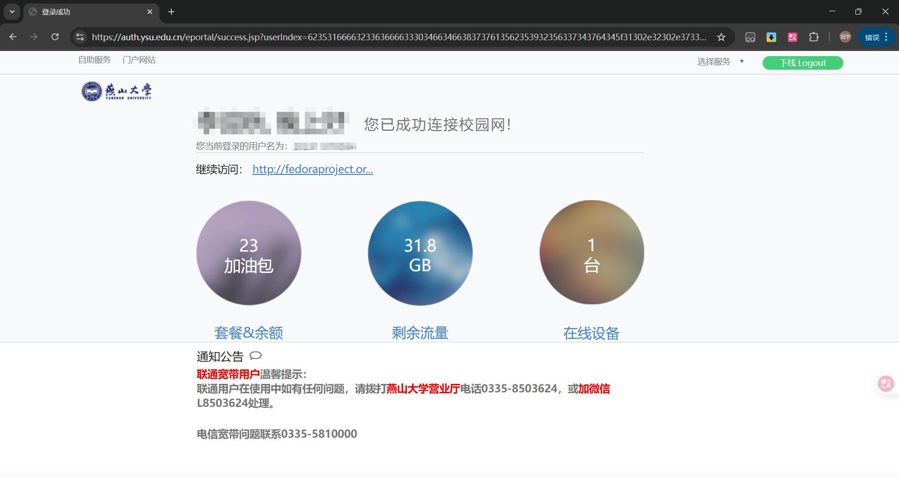
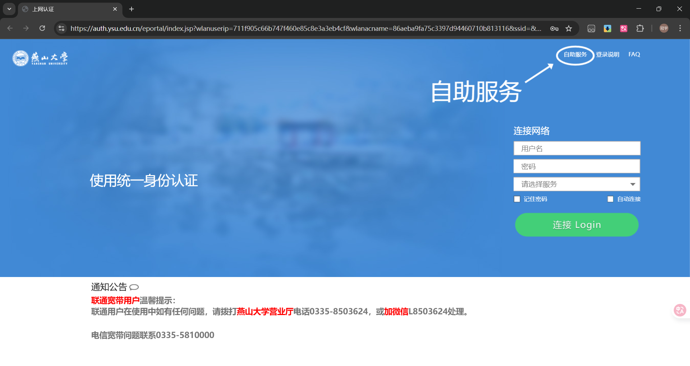
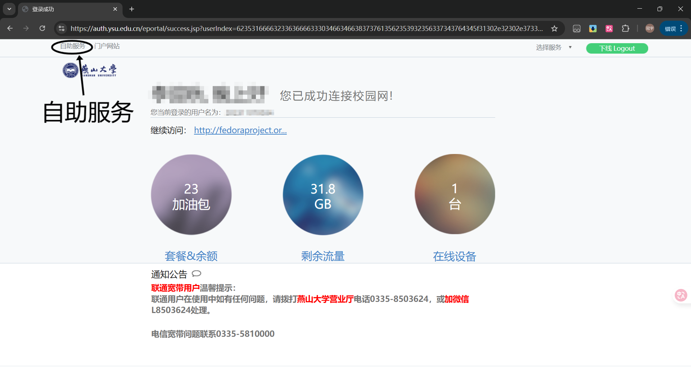
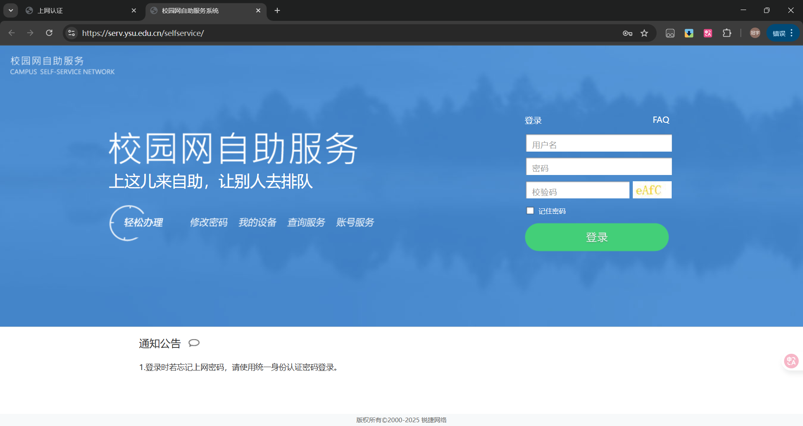
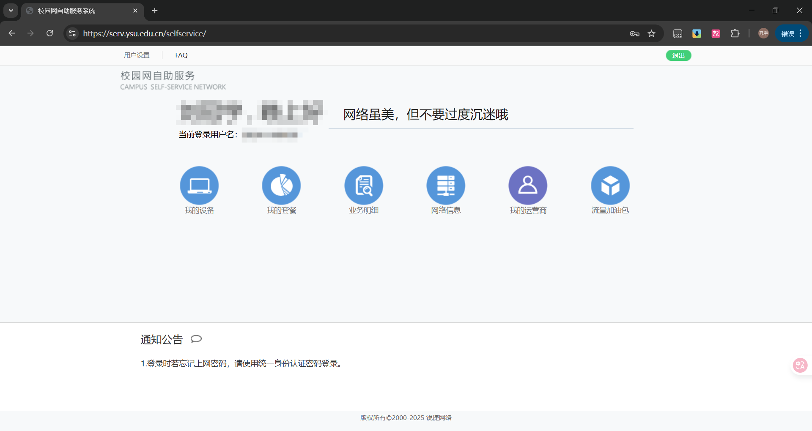
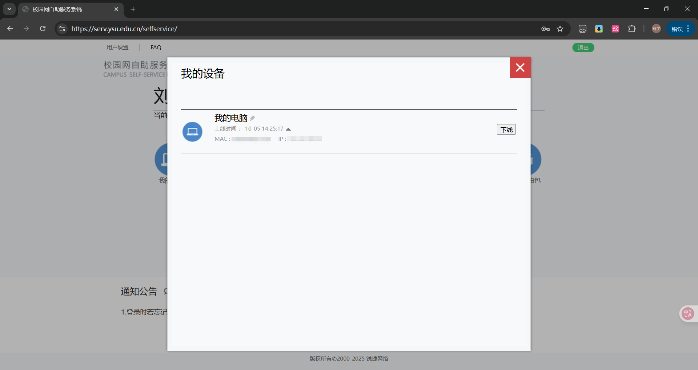
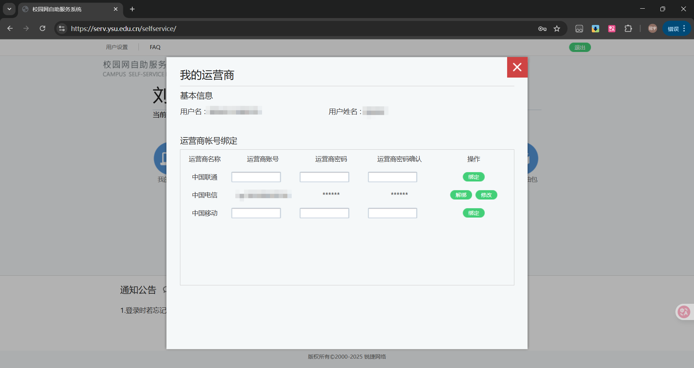

# 连接与认证方式

## 首次连接

### 进入认证页面
一般情况下，连接校园网后，手机会自动跳出一条通知，点击即可进行认证，电脑连接校园网后，打开浏览器也会自动跳出认证页面。如果没有自动跳出通知/页面，请打开手机或电脑自带的浏览器，在网址栏输入[auth.ysu.edu.cn](http://auth.ysu.edu.cn)或[10.11.0.1](http://10.11.0.1)，即可进入认证页面。

### 登录校园网
进入认证页面以后，在账号一栏输入自己的学号，密码一栏输入自己一网通办的密码，首次登录时，只能选择"系统默认服务"，然后点击“连接 Login”。弹出如下页面说明认证成功，可关闭页面。

## 非首次连接
大家在进行完第一次连接以后，再次连接校园网时，即可在服务选择栏选择校园网或三大运营商了，其余所有操作，与`首次连接`相同。

## 进入自助服务
在认证页面中，点击右上角或认证成功页面的左上角的“自助服务”

即可进入自助服务页面。

输入自己的学号和密码，即可登录到自助服务页面。

### 自助服务页面介绍
这个页面为大家提供了六种服务，分别是：
- 当前在线设备信息查看及管理
- 套餐管理
- 业务明细  
- 网络信息
- 我的运营商
- 流量加油包

下面介绍常用的两种服务：当前在线设备信息查看及管理、我的运营商
### 当前在线设备信息查看及管理
点击“我的设备”按钮即可进入，其中可以查看当前在线的设备信息，包括上线时间，IP地址，MAC地址。并能针对每个设备进行下线和重命名操作。

### 我的运营商
这个页面是用来绑定运营商的校园宽带账号的，当你成功办理了校园卡，运营商会提供给你账号和密码（若未提供，请联系引导你去办卡的人或直接联系运营商客服），你需要将对应运营商的账号和密码输入到对应位置，并点击绑定按钮，提示成功后即可在登录时选择对应运营商登录校园宽带。

