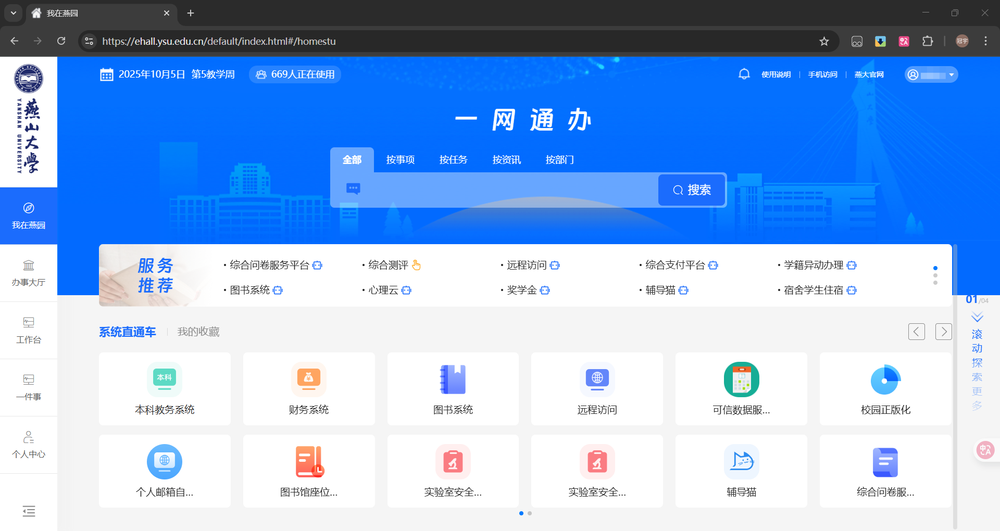
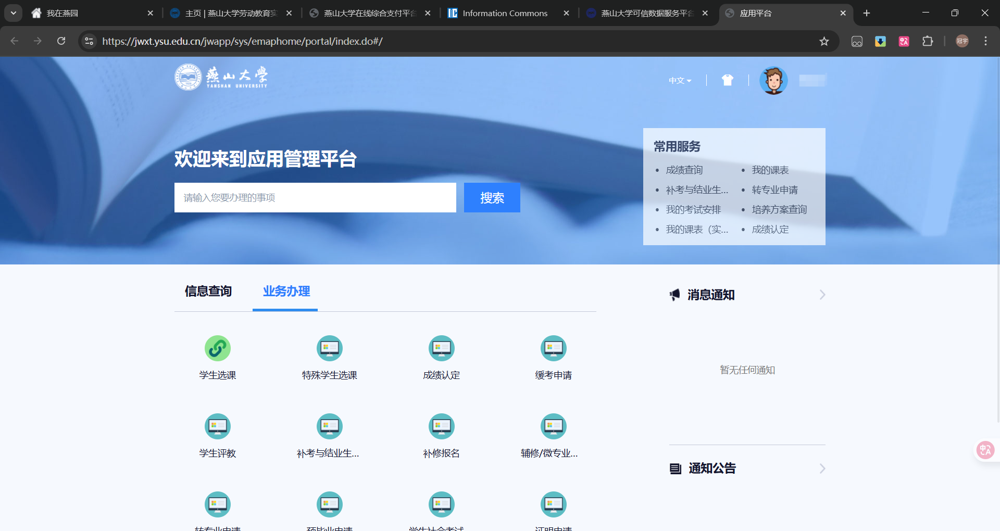
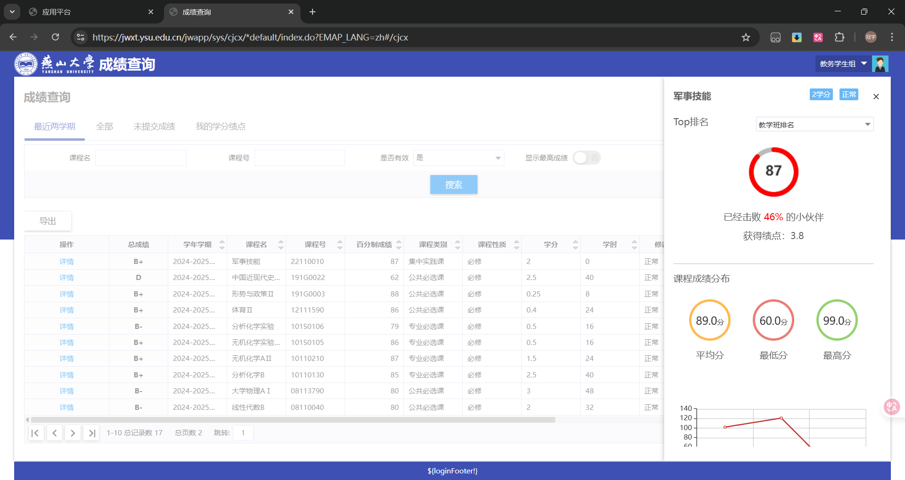
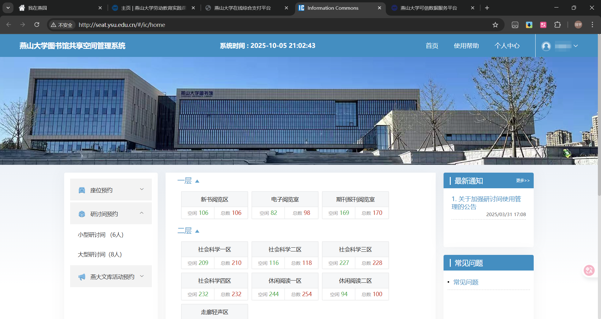
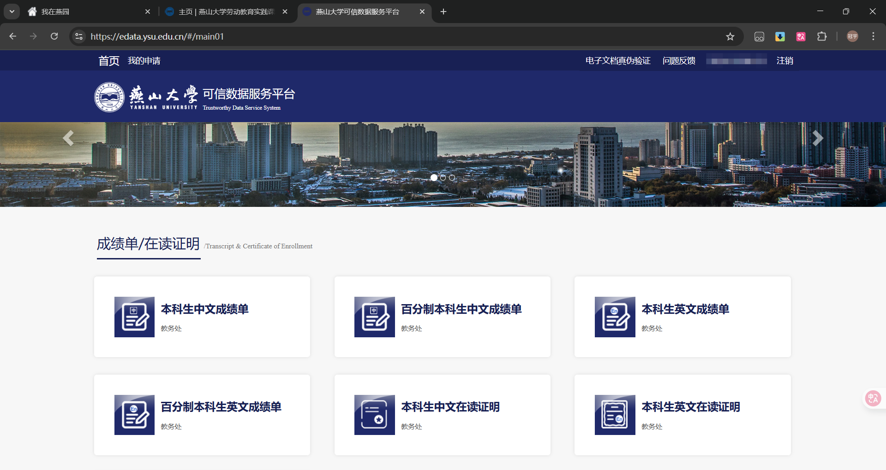
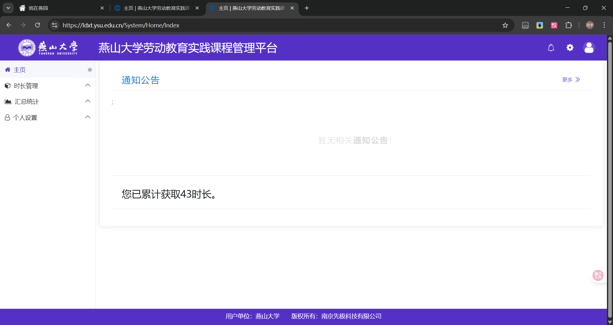

# 一网通办

## 简介

它集成了学校服务事项清单，致力于实现师生办事“只进一扇门”“最多跑一次”的目标，是校园服务的“百宝箱”。大家平时关心的服务事项，例如成绩查询，费用缴纳，图书馆座位预约等，均可以直接在一网通办平台上完成。一网通办还有一个优点，就是免去了办理不同事务的不同网页间需重复登录的问题，大家只需要登录一网通办后从一网通办进入不同网页，即可免登录直接使用。

## 访问方式及使用指南

一网通办平台的网址为：[https://ehall.ysu.edu.cn](https://ehall.ysu.edu.cn)。登陆成功后，在主页的搜索框中输入待办事项，即可搜索到相关服务事项。

## 常用功能介绍

在大学生活中，一网通办中的部分功能是我们经常会用到的，下面进行说明。

### 本科教务系统

[访问链接](https://jwxt.ysu.edu.cn/)
这个系统是我们平时最常用的功能，它提供了成绩查询，课表查询，培养方案查询，学生基本信息变更，选课，补考/重修报名，转专业申请，评教等众多功能。

与一网通办一样，这里也支持待办事项的搜索，大家将自己关心的服务事项输入到搜索框中，即可快速找到相关功能。

#### 成绩查询

当你的课程评教未完成时，无法查询到对应课程的成绩，评教过期无法补评，所以大家要注意评教的截止时间。  
燕山大学的成绩评定是通过绩点进行的，在成绩查询下`我的学分绩点`页面，大家可以看到自己目前的总绩点，我们一般特别关注`平均绩点（初修含选修）`与`必修课不及格学分`。前者是学校一切成绩相关的指标，包括转专业成绩评定，保研绩点计算等，而后者是你所有不及格科目的学分总和，若其不为0，代表你有课程不及格，需要注意。  
绩点与成绩的对应关系间见下面这篇文章。[绩点与成绩的对应关系](https://jwc.ysu.edu.cn/info/1089/3412.htm)  
如果你想查看某门课程的具体百分制分数，可以点击左侧的详情按钮。

点击成绩表格左上方的导出按钮，即可下载对应的excel文件。  

#### 培养方案查询

TODO

### 图书馆座位预约

[访问链接](http://seat.ysu.edu.cn/)  
如果你经常出入图书馆，那么这个系统你一定会经常用到，燕山大学的图书馆在考研复习阶段和期末考试前的一段时间内，人都会非常多，这个时候你要是想抢一个好位置，就要用到这个系统。

在该系统中，大家可以查看每个楼层空余的座位以及空余的研讨间，同时也可以进行座位及研讨间的预约，以下是一些注意事项：

1. 该系统每天零点到六点前的某一段时间内处于关闭状态，无法访问。
2. 座位预约从早上六点开始，图书馆在教学周内早八点开门。
3. 图书馆的进馆实行积分制度，每人每学期拥有300的初始积分，每有一次违约行为，如座位选取后未在规定时间内完成签到，“暂离”操作后未在规定时间内返回，每次违约会扣除100积分，若积分降至0，将进入黑名单，进入黑名单后，会被禁止含进入出发当天在内的4天座位预约权限，处罚结束后，积分恢复至300。
4. 图书馆的座位预约成功后，需要在预约开始后的15分钟内刷卡进馆（如预约9:00-15:00的座位，则需要再9:15前进馆）。
5. 图书馆提供暂离功能，非用餐时段座位保留1小时，用餐时段（11:00-13:00，17:00-18:30）座位保留2小时。
6. 暂离成功后，需要在座位释放前返回图书馆，超时将计入一次违约，同时座位释放。

### 可信数据服务平台

[访问链接](https://edata.ysu.edu.cn/)  
这个平台是用来下载各种官方成绩的数据，这些数据都携带有学校公章，可直接用于相关的业务。

可供下载的数据有：本科生中/英文成绩单，百分制中/英文成绩单，中/英文转专业证明，四/六级证明。  
点击对应按钮后，填写手机号和邮箱，点击确定后等待一段时间，数据会以pdf文件的形式发送到你的所填邮箱中。

### 劳动教育课程管理平台

[访问链接](https://ldxt.ysu.edu.cn/)  
燕山大学对于本科生，要求其在毕业前的劳动时长需累计达到80小时，这个系统就是用来管理劳动时长的。

在这个系统内，你可以查看自己当前一共获取了多少劳动时长，同时也可以报名相应的活动来增加劳动时长，
