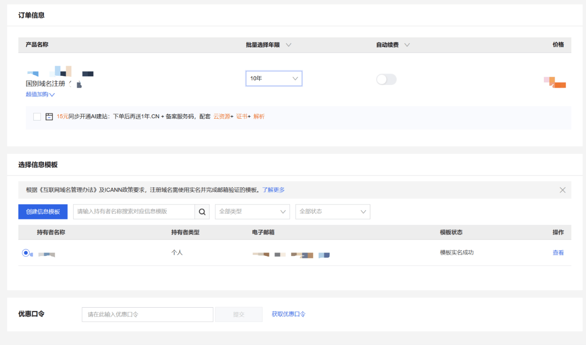
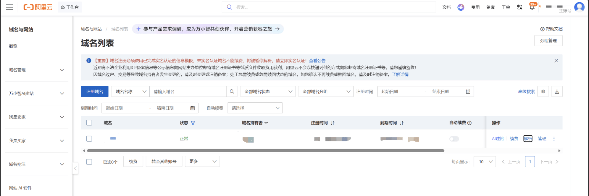
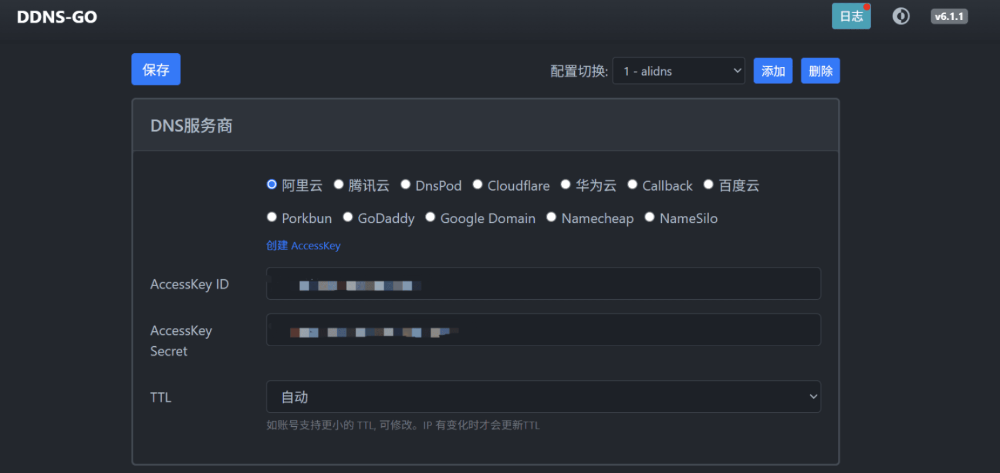
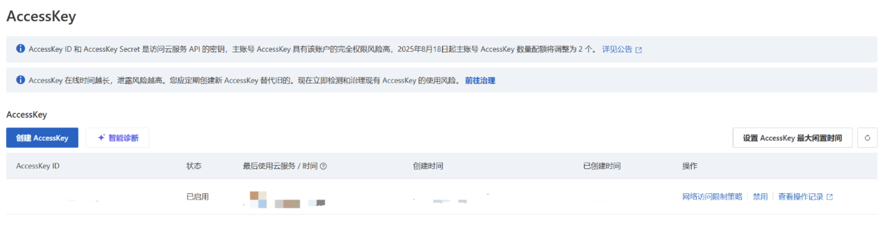
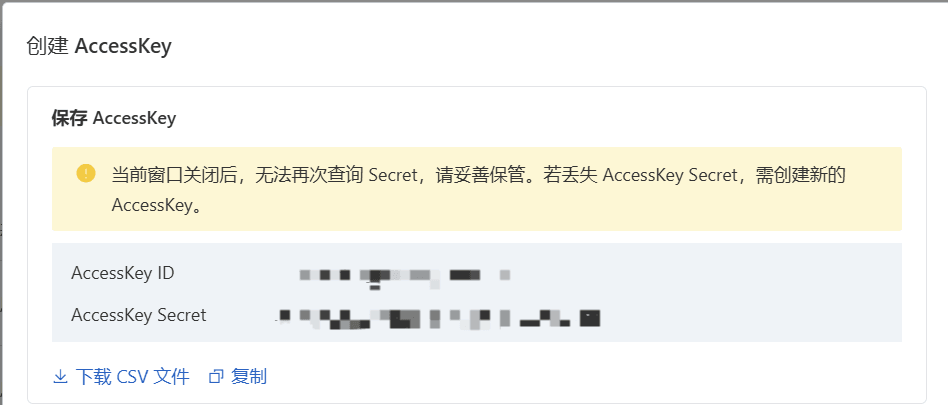

# 如何搭建你自己的 Minecraft 服务器（1）

**本文不涉及任何软件推销，仅做列举，分享！！！**

## 怎么购买域名？

这里以**阿里云**为例：

打开 https://wanwang.aliyun.com/domain/searchresult 
然后输入你想要的域名，填入信息模板

建议加购 **云解析 DNS**

等流程走完后，就可以在**域名控制台**里面看到自己的域名了

## 如何将自己的动态公网IP绑定域名？
首先，你需要安装 **DDNS-GO**

**[ DDNS-Go 的 GitHub 界面](https://github.com/jeessy2/ddns-go)**

请按照 **README.md** 的内容自行安装

**你需要配置的内容包括：**
> - 登录密码（首次设置后用于后续管理）
> - 选择 DNS 服务商（如果你按照前文设置的话，这里应该选择阿里云）
> - 配置要更新的域名和子域名
> - 选择 IP 的获取方式（推荐使用官方默认接口）
> - 设置同步 TTL、记录类型（A/AAAA）

（A记录是负责 IPv4，AAAA 记录负责 IPv6。**需要注意的是，若同时启用A记录和AAAA记录，Java会优先使用 IPv6，但若客户端的网络不支持 IPv6，将会导致无法连接的情况！**）

然后进入 `https://localhost:9876`

点击创建 AccessKey，会直接跳转到阿里云的 AccessKey 管理界面

然后点击创建 AccessKey

将得到的 AccessKey ID 和 AccessKey Secret 输入到 DDNS-GO 中，过一会，就可以在域名的**云解析 DNS** 中看到添加的 A/AAAA 记录了。这样你的域名和动态公网 IP 就绑定好了