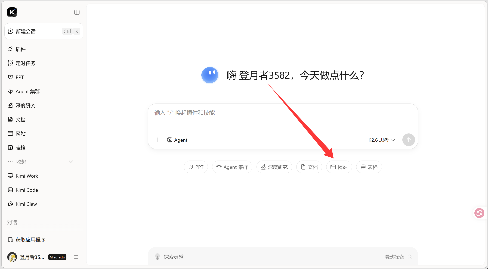
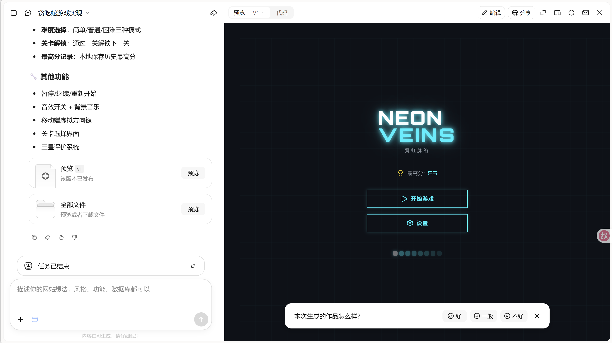

---
tags:
  - Vibe Coding
  - AI工具
  - 开发入门
authors:
  - liugu2023
  - HaoxiangXia
---

# Vibe Coding 入门：从对话式原型开始

>「Vibe Coding」（氛围式编码）指的是用自然语言向 AI 描述需求，由 AI 代理（Agent）读写代码、运行命令、完成部分开发任务的编程方式。开发者主要负责描述需求、检查结果和决定是否合并改动。

## 如果你完全不会写代码，现在的 AI 能帮你做到什么程度？

大致来说，你可以把当前大模型的能力理解为：可以胜任简单的内部小工具、数据可视化看板，以及一些轻量级小游戏的开发。这些能力用来做自用工具、从产品经理视角验证需求，基本已经足够。但若想一键生成可直接商用的成熟产品，通常仍需要人工在流程设计、细节打磨上持续优化。

接下来，我们就以贪吃蛇为例，具体看看 AI 编程目前到底能做到什么程度。

首先，请你打开 [KIMI网页版](https://www.kimi.com/) ，下文将以此演示。



点击**网页**按钮后输入我们的需求：

```
帮我做一个贪吃蛇游戏：
1. 用方向键控制蛇的移动
2. 吃到食物后蛇会变长，分数增加
3. 撞到墙壁或自己的身体就游戏结束
4. 要有开始和重新开始按钮
5. 界面要简洁好看
```


生成结束后，你能看到右侧出现可浏览的网页界面。[点击查看笔者的效果](https://6j44qaz3nn5s2.ok.kimi.link)




## 对话编程能做什么不能做什么
>当你只依赖对话式 AI、不写任何代码时，它究竟能把事情推进到哪一步。 在经验层面，一个较为稳定的结论是：它可以帮你完成一个“小而完整”的东西，但“做到什么程度就算够”，仍然需要你亲自决策每一步的详细步骤。

### 更擅长“小而清晰”的应用
从前面的贪吃蛇示例中，你已经看到了一种典型模式： 只要你能把界面和交互说清楚，AI 通常可以在几轮对话内，拼出一个可以打开、可以点击、可以玩的完整网页。

这类任务往往具备几个共同特征：
- 范围清晰：一页网页、一个简单内部工具、一个小玩法
- 结果可见：你能立即在浏览器中验证是否按预期工作
- 纠错直接：发现问题后，可以在后续对话中点明具体现象并要求修正（通过复制错误直接粘贴，或者截图粘贴的形式让 AI 进行修改）

在这个边界内，你可以把对话式 AI 看作一位执行力不错的"辅助开发者"。你只需在每一轮用自然语言细化和修正需求，就能快速得到可用的原型。

### 大型项目需要“流程视角”
一旦超出小而清晰的范围，只指望靠几轮对话让 AI 端到端完成复杂系统，很快就会遇到上限。大型项目往往要接后端、连数据库、整合第三方服务，还牵涉权限、安全、并发和大量业务规则，目标是交付一整套与现有业务深度打通的系统，而不是一页网页。

在这种情况下，更合理的做法不是把所有需求一股脑丢给 AI，而是先梳理出清晰的整体流程：关键步骤是什么、每一步的输入输出和状态变化是什么、哪些节点对性能和安全最敏感。再基于这张流程图，把相对独立的环节拆分出来，交给对话式 AI 生成接口、模块、脚本和测试。

以目前的能力来看，AI 更擅长加速一个个小步骤，由你（或你的团队）来决定怎么拆步骤、如何串联，并负责最终的架构设计、系统集成和运维。

## 进阶阅读：AI 编程工具

如果想进一步了解 IDE、AI IDE 和终端中的 Coding Agent，可继续阅读 [AI 编程工具：IDE、AI IDE 与 CLI Coding Agent](./tech-coding-tools.md)。

---

## 附录 ：到底什么是 Vibe Coding

>计算机科学家 Andrej Karpathy（OpenAI 的联合创始人之一，特斯拉前 AI 负责人）于 2025 年 2 月提出了 vibe coding 一词。这个概念指的是一种依赖于 LLM 的编码方法，允许程序员通过提供自然语言描述而不是手动编写代码来生成可工作的代码。

从字面上看，Vibe Coding 可以理解为一种“用说的方式来做开发”。它的核心变化在于：你不再需要自己一行一行写代码、查语法、调 Bug，而是直接用自然语言描述你想要的东西，例如：

“我需要一个登录页面，上面有手机号输入框和验证码输入框。” “登录成功后，跳转到首页，并在右上角显示用户名。” “给我一个简单的贪吃蛇小游戏，可以用键盘方向键控制。” 大语言模型（LLM）会把这类描述自动翻译成真正可以运行的代码，并生成对应的页面、逻辑和数据结构。你看到效果后，再用自然语言提出修改意见，例如“按钮再大一点”“背景换成深色”“得分记录下来并显示排行榜”，AI 会继续按你的要求调整实现。

在这种模式下，你不需要先学会编程语言，再去写代码；而是把主要精力放在：说清楚要做什么、看到结果后判断“哪里不对”、再提出新的修改。AI 则负责把这些高层的想法落成具体实现，从而显著减少机械、重复的编码工作。

你可以点击这里查看更多关于 vibe coding 的细节：https://www.ibm.com/think/topics/vibe-coding

你可以点击这里查看更多关于 Karpathy 的分享内容：https://karpathy.bearblog.dev/blog/

### 如何假装自己是 Vibe Coding 大师
实际上，在真正的 vibe coding 过程中，我们通常不会使用很多复杂的提示词。也许我们在开始时需要为整个程序提供一个具体且适度复杂的提示词，但在那之后的每一步，你可能只需要以下类型的提示词：

```
"代码里有个 bug，请修复它。"
"我不要部分代码，给我完整的修改后的代码。"
"你的代码还是有问题。"
"请再次修改并给我完整的修正后的代码。"
"刚才还能运行，为什么现在不能运行了？"
"你没理解我的意思吗？不要改我原来的代码。"
"不要添加任何调试功能。"
"不要做我没让你做的事。"
"我让你实现的功能在哪里？"
"你听不懂我说的话吗？"
"我只要一个函数。"
"我告诉过你参考我之前的代码。"
"请不要添加不必要的注释。"
"请不要修改我原始代码的基本逻辑。"
"帮我修改代码。"
"基于我的代码修改..."
"不要改我的变量名！！！"
"不要改原来的函数名！"
"不要乱动我的变量。"
"不要添加额外的功能。"
"不要只生成框架，生成完整的代码。"
```
这听起来可能有点夸张，但实际上，这些就是我们在日常工作中可能使用的提示词。由于大语言模型的上下文长度限制，或者有时因为它们的指令遵循能力不是很强，模型可能会忘记对话早些时候讨论的内容。在 vibe coding 中，我们倾向使用长上下文的模型，并且使用指令遵循能力强的模型，我们可以通过这两者的排行或者指标来判断其是不是好模型。

或者，由于训练数据集的风格，大模型倾向于以其训练数据的风格回答。例如，有些人说话很严肃，有些人喜欢添加很多修饰，而有些大模型喜欢在代码中添加很多注释或不必要的模块。
